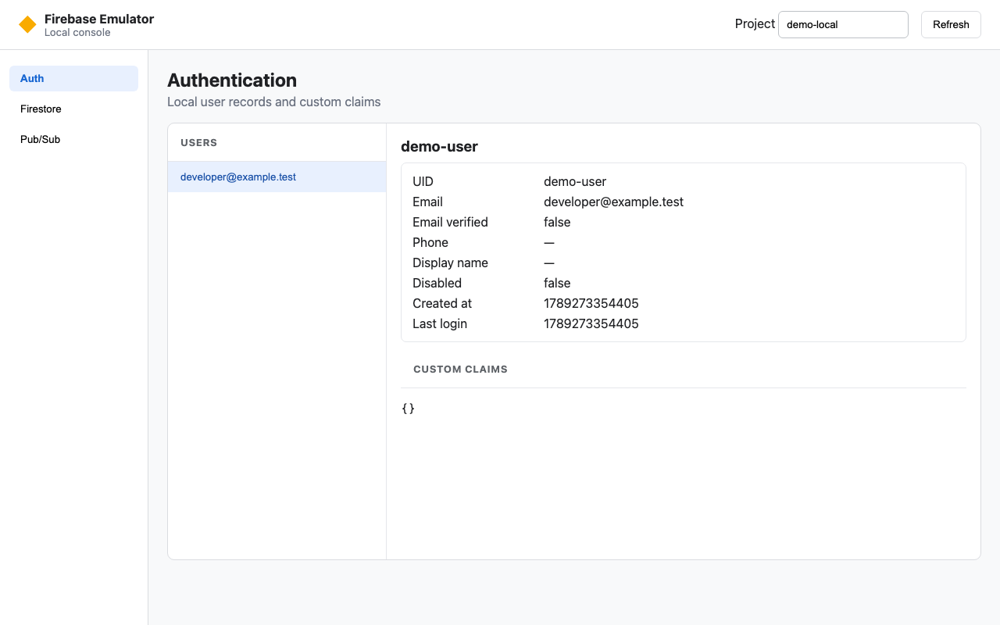
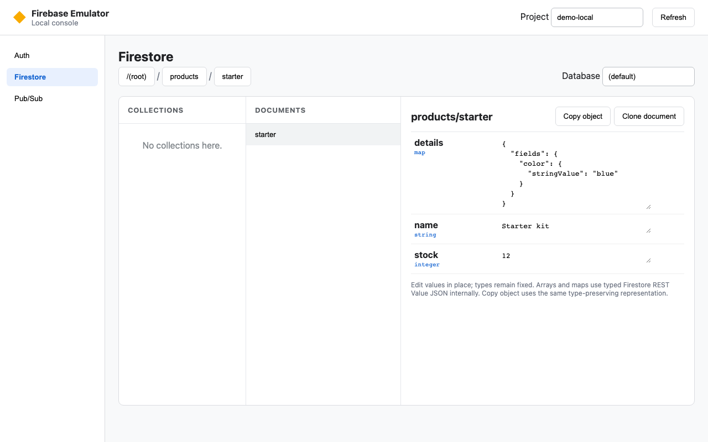
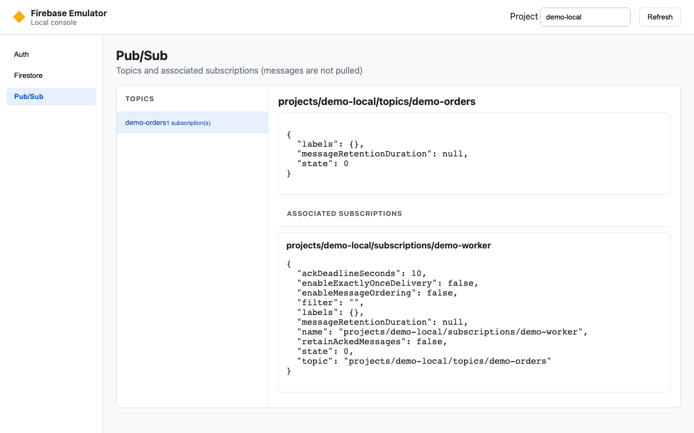
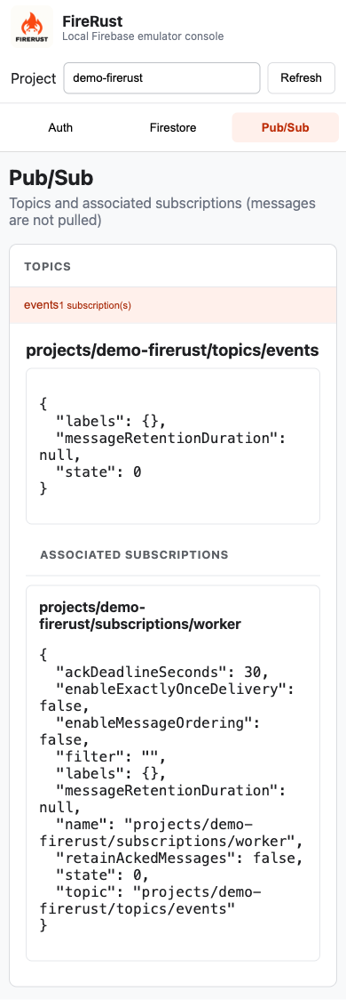

# FireRust console

The console is embedded in the `firebase-emu` executable. It uses only the
loopback services in the same process. It does not discover cloud credentials
or production endpoints.

Use the URL that FireRust prints at startup. The default is
`http://127.0.0.1:4000`. If you use `--ui-port 0`, FireRust selects a free
port. If a selected nonzero port is in use, FireRust selects a free port and
prints the new URL. Use `--no-ui` to disable the console.

The project selector controls all views. Firestore also supports named
databases.

## Auth

The Auth view lists local users. It shows the complete local user record and
parsed custom claims.

## Firestore

The Firestore view has collection, document, and field columns. Breadcrumbs
show the current path. Open a nested collection from its parent document.

You can edit values inline. Each fixed Firestore type appears below its field
name. An invalid typed value does not change the document.

### Copy an object

**Copy object** copies the document `fields` map as Firestore REST Value JSON
v1. Each value has an explicit type wrapper.

The wrappers include `integerValue`, `timestampValue`, `bytesValue`,
`referenceValue`, `geoPointValue`, `arrayValue`, and `mapValue`. This
format preserves types that plain JSON cannot safely represent.

### Clone a document

**Clone document** requires a destination collection path and document ID. The
operation is atomic and preserves Firestore field types. A must-not-exist
precondition prevents overwrite.

Subcollections are not included by default. Select the separate checkbox to
include them. External object import is not in the beta scope.

## Pub/Sub

The Pub/Sub view lists topics, topic settings, and subscriptions. It reads
broker metadata only. It does not pull, acknowledge, nack, or change queued
messages.

  

All screenshots use synthetic local data and newer FireRust source. They do
not show the published v0.1.5 console. The Pub/Sub screenshots use a separate
synthetic topic. The quickstart seed does not create a topic.
